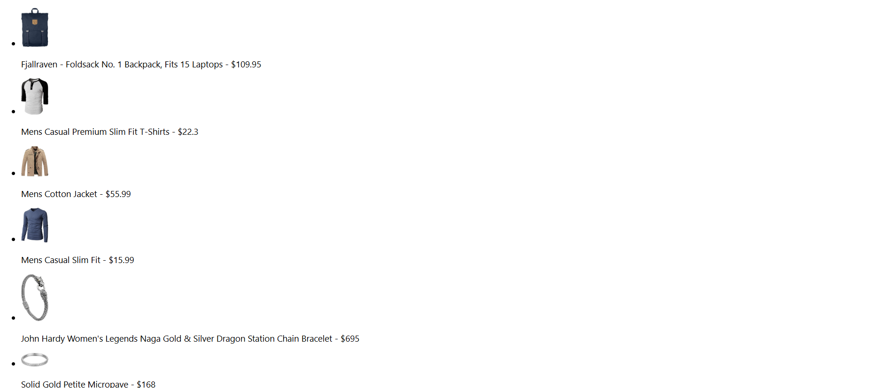

# 🛍️ Products List React App

This is a simple React application that fetches product data from the [Fake Store API](https://fakestoreapi.com/) and displays a list of products with their image, title, and price.

---

## 📸 Screenshot

---

## 🚀 Features

- Fetches products from a live API
- Displays product image, name, and price
- Uses `useEffect`, `useState` React hooks
- Error and loading handling

---

## 🔧 Technologies Used

- React

